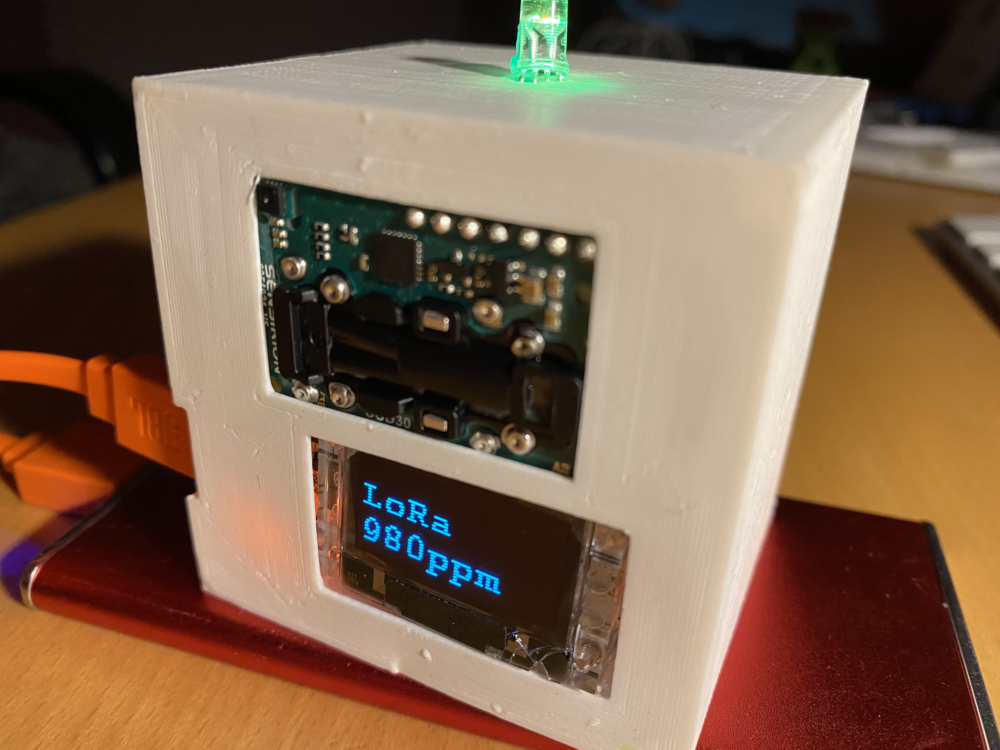
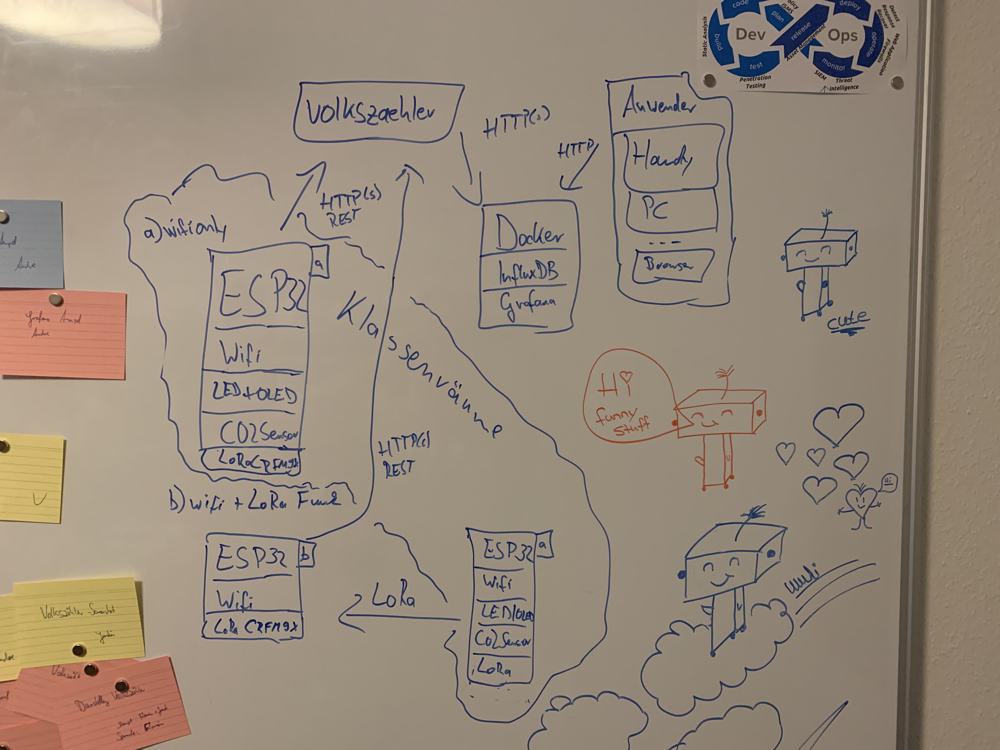
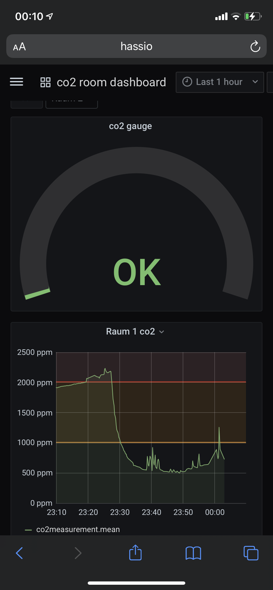

# Klassenzimmer Modul



## Hardware:
- Heltec WiFi Lora 32 V2 mit OLED
- SCD30 CO2 Sensor
- RGB LED zur Signalisierung der CO2 Konzentration (rot, gelb, grün)
- OLED Display zur numerischen Anzeige CO2 Konzentration, Luftfeuchtigkeit und Temperatur sowie WiFi oder LoRa Status

## Funktion:
  CO2, Luftfeuchtigkeit und Temperatur aus dem SCD30 lesen und
  auf dem OLED darstellen. Grenzwertüberschreitung an der RGB LED anzeigen.
  Digitale Werte über WiFi nach volkszaehler.org schreiben oder über LoRa
  an eine LoRa-Wifi-Bridge senden.

# LoRa-WiFi-Bridge

# Hardware:
- ESP32 WROOM32
- RFM9x LoRa 868/915MHz

# Funktion:
- Werte über LoRa entgegennehmen und über WiFi weiterleiten

# Server Installation unter Ubuntu

Wir liefern eine vorkonfigurierte Umgebung unter Ubuntu. Um den Server aufzusetzen (Installation von Docker und Docker-Compose und weiterer Abhängigkeiten) kann unsere [Setup-Anleitung](SETUP-Server.md) verwendet werden.

# volkszaehler.org

- Von einem Teammitglied betrieben
- freie Software, kann auch z.B. auf einem RPi betrieben werden
- Ursprünglich für Smartmeter (Stromverbrauch, Heizung usw.) gedacht
- keine Anmeldung, Schreib- und Lesezugriff erfolgt über UUIDs

# Datenfluss



Die Klassenzimmermodule erfassen die Temperatur, Luftfeuchtigkeit und CO2 Konzentration.
Grenzwertüberschreitungen werden an der RGB LED angezeigt, zudem alle Werte auf dem OLED dargestellt.

Besteht eine WLAN Verbindung, werden die erfassten Daten direkt per http auf volkszaehler.org hinzugefügt.
Besteht keine Verbindung, so werden die Werte über LoRa gesendet.

Die LoRa-WiFi-Bridge nimmt in dem Fall die Werte über LoRa entgegen und gibt diese über http weiter

# Grafana Docker Setup

;

Mittels Grafana lassen sich die Messwerte sehr anschaulich visualisieren. Die Werte können als Momentanwerte
oder als zeitlicher Verlauf dargestellt werden. Grafana lässt sich auf einem normalen PC im Browser nutzen oder
auch auf einem Tablet oder Smartphone.

Grafana bezieht die Daten aus volkszaehler.org und stellt diese dann dar. 

Die Installation von Grafana kann auch einem PC oder einem Server erfolgen. Die hierfür benötigten Dateien befinden
sich im Unterordner Visualisierung.

Current implementation uses volkszaehler for gathering sensor data.

Configure Polling settings in poll-volkszaehler/php/config. See [README](poll-volkszaehler/README.md).

```
docker-compose up
```

# on co2

co2 is measured in ppm (parts per million)


data ranges from 250 ppm (normal ambient air) - > 40.000 ppm (toxic) 
https://www.kane.co.uk/knowledge-centre/what-are-safe-levels-of-co-and-co2-in-rooms


sanitary safe levels of co2 in rooms:

| co2 concentration (ppm) | sanitary rating | suggestion                       |
|:-------------:|:-------------------:|:--------------------------------------:|
| < 1000        | uncritical          | no actions needed                      |
| 1000–2000     | noticeable          | ventilation needed                     |
| >2000         | unacceptable        | additional ventilation measures needed |

source: https://www.umweltbundesamt.de/sites/default/files/medien/pdfs/kohlendioxid_2008.pdf

in regards to covid:

| #     | co2 concentration (ppm) | color       |
|:-----:|:-----------------------:|:-----------:|
| IDA 1 |  350 - 549              | green       |
| IDA 2 |  550 – 1049             | light green |
| IDA 3 | 1050 - 1549             | yellow      |
| IDA 4 | > 1550                  | red         |

source: ["Risikobewertung von virenbeladenen Aerosolen anhand der CO2-Konzentration"](co2-colors.png)
Autoren: Anne Hartmann, Martin Kriegel
Technische Universität Berlin, Hermann-Rietschel-Institut
DOI: http://dx.doi.org/10.14279/depositonce-10361

# Weitere Ideen, die es nicht in den Prototypen geschafft haben

## Gehäuse
- Halterungen für die Bauteile (im Prototyp nur geklebt)
- kompakter durch passende Leitungslängen oder Platine
- Gehäuse für die LoRa-Wifi-Bridge
- für Grundschulen eine andere Gehäusevariante: Ein 3D gedrucktes Haus mit Fenster. Ein Servo öffnet die Fenster bei überschreiten des Grenzwerts (anstelle einer roten LED)

## Elektronik
- Einbau eines LiPo-Akkus → mobiler Betrieb; Controller hat schon Laderegler integriert

## Software
- ESPs in den Klassenräumen:
  * Lineare Regression über die letzten 5min C02 Werte um die voraussichtliche Zeit bis zum Überschreiten des Grenzwertes zu berechnen.
  * Abfallen der CO2 Konzentration erkennen und den asymptotischen Verlauf erkennen. Empfehlung zum Schließen der Fenster geben, wenn Änderungsrate unter Schwellwert fällt. Hintergrund Energiesparen, nur so lange Lüften wie auch Sinn macht.

## Rollout
- automatische Erzeugung von UUIDs, die das Flashen mit identischen Binaries erlaubt (vzero?)
